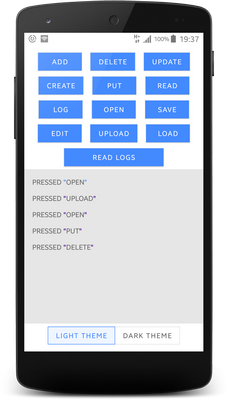
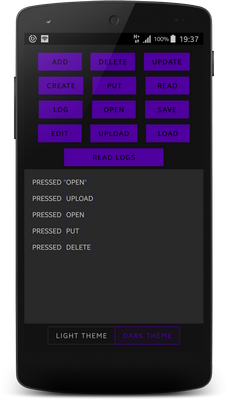
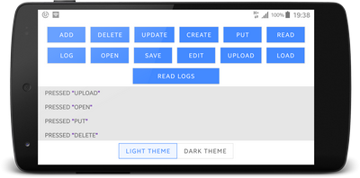
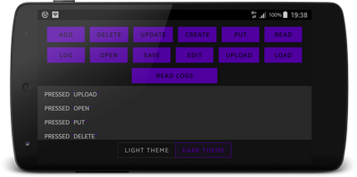

Service
=======

Articles that helped me
-----------------------
* [Services](https://developer.android.com/guide/components/services) - an application component that can perform long-running operations in the background
* [KotlinxCoroutines](https://kotlinlang.org/docs/reference/coroutines-overview.html) - asynchronous or non-blocking programming is the new reality
* [Android KTX](https://developer.android.com/kotlin/ktx) - write more concise, idiomatic Kotlin code.
  * [androidx.fragment:fragment-ktx:1.2.0-beta01]() - easy fragment transactions / method *by viewModels() {SavedStateViewModelFactory()}* instead ViewModelProvider
  * [androidx.lifecycle:lifecycle-viewmodel-ktx:2.2.0-beta01](https://developer.android.com/kotlin/ktx?gclid=EAIaIQobChMIq-uL-Ivg5QIVh813Ch39WQ2nEAAYASAAEgIVKfD_BwE) - viewModelScope for view Model
  * [androidx.lifecycle:lifecycle-livedata-ktx:2.2.0-alpha01](https://developer.android.com/kotlin/ktx?gclid=EAIaIQobChMIq-uL-Ivg5QIVh813Ch39WQ2nEAAYASAAEgIVKfD_BwE) - coroutines for liveData
  * [androidx.lifecycle:lifecycle-runtime-ktx:2.2.0-alpha01](https://developer.android.com/kotlin/ktx?gclid=EAIaIQobChMIq-uL-Ivg5QIVh813Ch39WQ2nEAAYASAAEgIVKfD_BwE) - lifecycleScope for Fragment/Activity  and launchWhenResumed
  * [androidx.navigation:navigation-runtime-ktx:2.2.0-beta01](https://developer.android.com/kotlin/ktx?gclid=EAIaIQobChMIq-uL-Ivg5QIVh813Ch39WQ2nEAAYASAAEgIVKfD_BwE) - Acitivty.findNavController + Activity.navArgs + View.findNavController
  * [androidx.navigation:navigation-fragment-ktx:2.2.0-beta01](https://developer.android.com/kotlin/ktx?gclid=EAIaIQobChMIq-uL-Ivg5QIVh813Ch39WQ2nEAAYASAAEgIVKfD_BwE) - Fragment.findNavController + Fragment.navArgs
  * [androidx.navigation:navigation-ui-ktx:2.2.0-beta01]() - setupActionBarWithNavController for toolbar + setupWithNavController for bottomAppBar
*  [DarkTheme](https://habr.com/ru/company/redmadrobot/blog/461201/) - article how to implement dark theme
*  [ConstraintLayout2](https://proandroiddev.com/awesomeness-of-constraintlayout-flow-aa0b5edd5df) - flow for arranging many elements
*  [ColorTheme](https://stackoverflow.com/questions/30470437/android-theme-using-multiple-colors-xml) - set theme color via xml
*  [KotlinCallback](https://stackoverflow.com/questions/50529198/what-is-better-approach-of-callback-in-kotlin-listener-vs-high-order-function) - What is better approach for callback
*  [SavedStateModule for ViewModel](https://developer.android.com/topic/libraries/architecture/viewmodel-savedstate) - onSaveInstanceState() but for viewModel
*  [StrictMode](https://developer.android.com/reference/android/os/StrictMode) - StrictMode is a developer tool which detects things you might be doing by accident and brings them to your attention so you can fix them.
*  [CustomAttrInTheme](https://stackoverflow.com/questions/6860886/custom-attributes-in-styles-xml) - easy way to create custom attribute for theme

